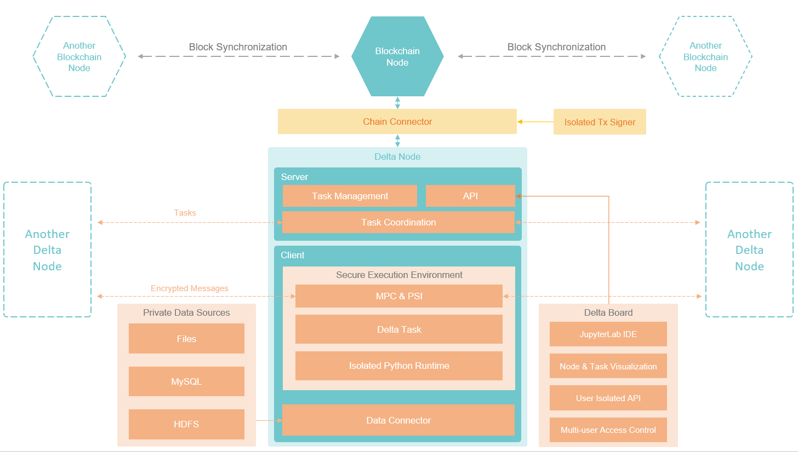

# 系统架构说明

## 系统参与者

系统参与者可以按照角色分为三类：数据所有者、数据使用者、网络搭建者：

**数据持有者**

数据持有者持有原始数据，不希望原始数据被泄露出去。在数据不出门的前提下，接收其他参与者的计算任务，在本地完成计算并将计算结果发送回去。在Delta框架中，数据持有者在本地搭建Delta节点接入隐私计算网络，并将Delta节点接入本地的原始数据源。Delta节点从网络中接收计算任务，在本地的数据集上执行计算过程，得到计算结果，并将加密后的计算结果发送回隐私计算网络。

**数据需求方**

数据需求方不持有数据，但是有一些计算需求，需要在其他多个数据持有者的数据集上执行一些计算任务（分为统计计算和机器学习模型训练两类），获取计算结果，并需要确保计算结果的正确性。在Delta框架中，数据需求方使用Delta提供的Python框架编写计算任务（Delta Task），通过Delta Node提供的API将Task发送到隐私计算网络中完成计算，获取计算结果。

数据需求方可自行搭建Delta Node，接入隐私计算网络，并通过自己的Delta Node提交计算任务。也可以在获得授权后，使用其他数据持有者提供的Delta Node来提交计算任务。

**网络搭建者**

网络搭建者需要联合一个特定行业的多家数据持有者一起，搭建一个隐私计算网络，将多家的数据源联合起来提供给数据需求方使用。由于数据持有者可能不具备搭建Delta Node的技术能力，一般由网络搭建者负责帮数据持有者完成Delta Node搭建和配置、原始数据源的接入工作，并负责Delta Node的日常运维工作。

在特定场景下，一个系统参与者可以同时具备多个角色。比如在联合医疗隐私计算场景中，一家医院既是数据持有者，将医院内部的数据接入隐私计算网络，同时又是数据需求方，医院内部需要使用全网的数据进行计算，将计算结果用于本院的系统优化或者科研。

## 网络结构

Delta隐私计算网络由Delta Node节点和区块链节点共同组成。每一家加入网络的数据持有者，都需要启动一个区块链节点以及一个Delta Node节点。

隐私计算网络首先由区块链节点完成P2P组网。Delta Node通过Chain Connector抽象层连接到区块链节点，在区块链上注册身份，获取待执行的计算任务，并上报计算过程和计算结果数据。Delta Node之间也会形成一个网络，用于计算任务的内容下发、结果上报，以及安全多方计算、PSI等隐私计算技术涉及到的多方秘密共享。

Delta Node的数据连接层连接到数据持有者的本地数据，可通过不同的适配器连接多种数据格式，比如文件、MySQL关系型数据库以及HDFS大数据存储等。Delta Node提供API供外部调用，完成任务注册、任务状态查询、计算结果下载等任务相关的功能，以及任务列表查询、节点状态查询、节点配置等节点管理的功能。

Delta Board用于对于Delta Node的可视化管理，同时嵌入JupyterLab做为IDE，实现在线的任务编写和调试。Delta Board提供多用户管理的功能，支持多人同时使用同一个Delta Node。

## Delta区块链

区块链的核心功能是确保多方对于同一套规则的强制执行。区块链一般用于构建非中心化系统，使得整个系统在没有中心控制方的情况下能够正常稳定运转。在隐私计算网络的场景中，各个数据持有者之间关系对等，也很难将整个系统的控制权交由一个单一的控制方，但是整个系统需要一套统一的规则来分发任务、执行任务、并且上报结果，因此非常适合使用区块链来构建一个非中心化网络。任何数据持有者都可以自由地选择何时加入、退出网络，而不会影响整个网络的正常运转。只要有计算需求，并且有数据持有者愿意提供数据，网络就可以正常运转。

在非中心化系统中有两个问题是需要额外考虑的，一个是激励的问题，一个是防作弊的问题。

激励的问题是说，系统的正常运转依赖于有足够的数据持有者加入网络做节点，提供数据和算力。如果没有足够的收益，数据持有者是不愿意加入网络的。在隐私计算网络中，数据提供者的收益理论上应该来自于数据需求方的付费。数据需求方付费购买数据使用权，换回计算结果，而数据提供者提供数据和算力，获得收益。系统可以在付费中扣除部分手续费，用于激励早期用户参与。这就构成了一个基础的激励模型。而区块链的作用，就是可以保证这个激励模型在没有中心化控制方的情况下正常稳定的执行。

有了激励，就有了作弊的问题。对于数据提供方来说，通过提供数据和算力可以获得收益，那么数据提供方就有伪造数据和算力，来获取额外收益的动机。因此，如何通过机制设计，在进行了一次计算任务后，可以识别出数据提供方提供了真实数据，并且完成了真实的计算，就成了一个难题。如果识别过程有漏洞，会导致计算结果不可信，以至于数据需求方不再使用本系统。

在目前的Delta框架中，我们假设激励的问题已经由网络搭建者通过外部手段解决。在框架中暂时不包括激励机制的设计和运行，而是专注于隐私计算本身的功能和性能，以更好的满足用户需求。对于数据以及计算过程的可信性保障的问题，则通过零知识证明来解决。详细说明请参考系统详细设计中的对应文档。

Delta中区块链的作用可以分为三个：

**无中心网络构建：**通过区块链来构建基础的隐私计算网络，实现网络节点发现、节点数字身份注册等功能。

**计算任务发布和计算任务协调：**通过智能合约保证网络中关于计算任务的发布、运行、上报的规则能够被统一执行。

**数据和计算的可信性保障：**日常更新数据的链上零知识存证，以及计算任务执行过程的零知识证明上链和校验。

Delta网络中的区块链节点可以使用Delta提供的Delta Chain搭建，也可以使用任意其他的区块链系统，比如Ethereum，只要在区块链上部署了其对应的Delta智能合约，并将Delta Node接入即可。Delta对于区块链系统唯一一个较高要求是，假如需要使用到数据和计算的可信性保障，则区块链系统需要支持zk-SNARKs底层需要的密码学操作EC Pairing。

Delta也提供了Solidity语言的智能合约，可直接部署在以太坊上。为了方便多种区块链系统的切换，以及安全的管理区块链账号涉及到的密钥，Delta抽象出了Chain Connector组件，用于管理Delta Node和区块链节点之间的连接。在Chain Connector中可以方便的切换不同的区块链系统，Chain Connector也支持配置一个额外的离线签名机用于密钥托管，实现密钥的离线保存和使用。

## Delta Node

Delta Node是整个隐私计算网络的核心，负责计算任务的整个生命周期的管理，包括任务注册、多节点间任务协调、任务本地执行、结果上报、结果聚合等整个任务执行流程，在整个生命周期中保证本地数据的隐私安全，同时对外提供API，供IDE或者其他系统接入。

## Delta Board

为了方便数据需求方本地开发调试，Delta提供了Delta Board实现对Delta Node的可视化管理。Delta Board中嵌入了JupyterLab，可以直接进行Delta Task的开发和可视化调试的工作。

除了JupyterLab以外，Delta Board支持账号和权限配置，可多人同时提交计算任务，并查看各自的任务执行状态。Delta Board中支持对于Delta Node的配置，可查看Delta Node的节点状态以及任务执行情况。

## Delta Task

