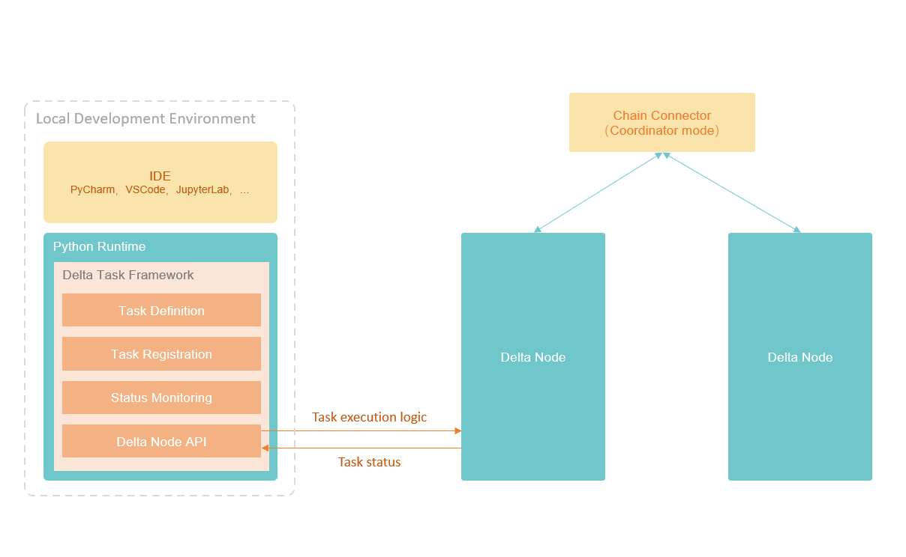

# 执行计算任务

Delta隐私计算网络的核心功能，就是在整个网络上完成计算任务的分发、执行，以及计算任务的聚合。在搭建好隐私计算网络后，我们就可以向Delta Node发送计算任务了。

Delta中的计算任务被抽象成[Delta Task](https://github.com/delta-mpc/delta-task)。Delta Task使用Python语言编写，开发者需要先import进来Delta Task框架，实例化一个Delta Task，并在Delta Task中完成数据预处理、训练模型的定义，然后将Delta Task发送到Delta Node进行执行。

Delta Node接收到Task后，在全网完成任务的分发，并根据任务定义，以及其他节点上报的数据情况，决定隐私计算的类型，将任务分类为横向联邦学习、纵向联邦学习和联邦统计中的一种，按照对应的隐私计算算法完成任务拆分、多节点协调和计算结果汇总，最终完成计算并得到计算结果。

为了方便开发者的开发调试工作，Delta Task框架中集成了Delta Node的API，可以直接调用Delta Node注册Delta Task，开始计算过程，并可以实时从Log中看到Task在Delta Node上的执行状况。通过这样的设计，只要开发者本地有Python运行环境，Delta Task就可以从本地开发环境中直接启动，而无需先进入另一个"任务上传"的界面上传代码。开发者只需要在Delta Task框架初始化时指定Delta Node的地址即可。

Delta Task的开发可以在任意支持Python语言的IDE中进行。Deltaboard中集成了JupyterHub，也就是支持多用户同时使用的JupyterLab，是在数据分析领域非常广泛使用的IDE，可以直接在线编辑代码，并实时显示执行结果。

Deltaboard的JupyterLab中放置了一个示例的Delta Task，在准备好了节点数据，并在Delta Task中修改了对应的文件名后，可以点击JupyterLab中的运行按钮，查看执行结果。开发者也可以尝试修改Delta Task的执行代码，并点击运行按钮查看结果。

在开始真正编写自己的计算任务以前，开发者还需要对Delta Task框架有更深入的了解。可以从详细了解这个示例任务开始：



在本文档的计算任务开发章节，也有更多的关于Delta Task框架的解释说明。

