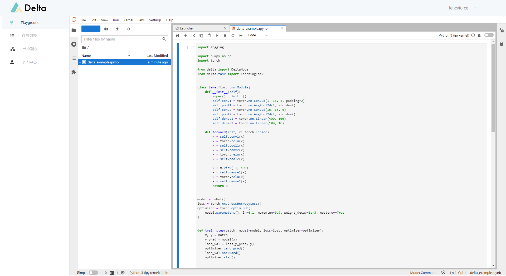

# 执行计算任务

在Delta隐私计算网络搭建完成后，我们就可以开始编写并执行一个Delta Task计算任务了。

Delta Task的开发可以在任意支持Python语言的IDE中进行。为了方便使用，Deltaboard中已经集成了JupyterHub，也就是支持多用户同时使用的JupyterLab，是在数据分析领域非常广泛使用的IDE，可以直接在线编辑代码，并实时显示执行结果。

Deltaboard的JupyterLab中放置了一个已经写好的Delta Task，启动Deltaboard的界面，进入JupyterLab的Tab，打开HelloWorld.ipynb文件，可以看到这个示例Delta Task的代码：

示例代码是一个通过神经网络进行手写数字识别的模型训练。需要用到手写数字的公开数据集[MNIST](http://yann.lecun.com/exdb/mnist)，Delta Node的Docker镜像提供了下载MNIST数据集的功能，并且仅随机保留1/3的样本数据以模拟多节点拥有不同数据的隐私计算场景，详情可参考：



在准备好MIST数据后，可以开始运行Deltaboard中的示例代码，首先进入Playground，打开`delta_example.ipynb`:

点击JupyterLab中的运行按钮，在代码块下方会出现任务成功提交的提示信息：

从执行Log可以看出，这个任务以横向联邦学习的方式，被分发给了网络中的全部节点并完成了多轮的训练。每轮训练中，各个节点完成本地计算后，上报了经过安全聚合处理的梯度向量，而我们的发起方Delta Node收到全部节点的统计结果后，求和得到了最终的训练模型。至此我们已经完成了第一个Delta Task的编写和全网运行。

在开始真正编写自己的计算任务以前，开发者还需要对Delta Task框架有更深入的了解。可以从详细了解这个示例任务开始：



在本文档的计算任务开发章节，也有更多的关于Delta Task框架的解释说明。

