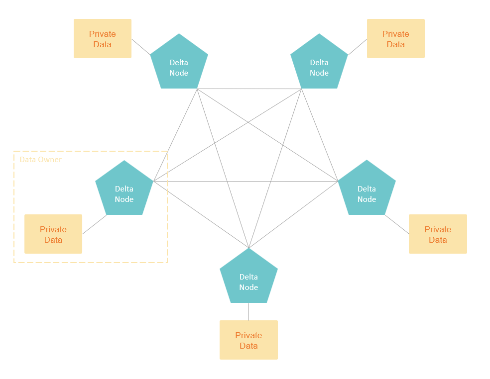
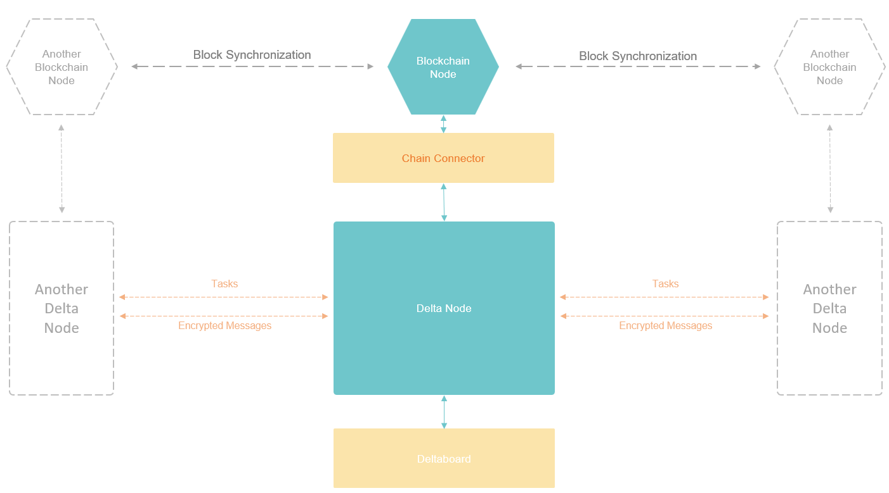

# System Overview

## Network Participants

The participants of the Delta Network could be categorized into 3 classes:

#### Data Owners

Data owners privately own some original data and they don't want the data to be revealed to any other people. Provided that the data will be secure and never exposed to others, data owners receive computation tasks from others, compute them locally and send the result back.

In the context of the Delta Network, data owners deploy Delta Node locally and connect it to their private data. Delta Nodes connect to the network, receive computation tasks, execute them locally on the private dataset, and at the end send the result back, in an securely encrypted format so that no one could decrypt even the original computation result from it. The result could only be used to be mixed with the results from other Delta Nodes to get a clear text statistical value on a wider range of data.

#### Task Developers

Task developers don't possess data themselves. They have some ideas and want to perform computation tasks on other data owners' data. There're usually two types of computation they want to perform: the statistical computation and the machine learning model training. And since they can never have an eye on the original data, they want to be sure that the computation is actually executed as they programmed, and on the real data they required.

In Delta Network, task developers write the computation task codes using the Delta Task framework, send the task to the network through the API that Delta Node provides, and then receive the computation result, together with a zero knowledge proof shows that the computation really happened as required.

To send tasks to the network through a Delta Node, task developers could deploy Delta Nodes themselves, or using one of the Delta Nodes provided by the data owners.

#### Network Deployers

The network deployers are usually able to union several large data owners \(or a lot of small ones\) in a specific industry. Network deployer connects their data by deploying a Delta Network. The data could then be used by other industry participants, or the data owners themself. Since most of the data owners in other industries don't have the ability to deploy Delta Node themself, it is usually network deployer's task to help them with the deployment, the connection and adaptation between the Delta Node and the original data sources. Network deployers are also responsible for the daily maintaining of the system. 

## Network Structure

Delta Privacy-Preserving Computation Network is a P2P network. Each data owner deploys a node to connect to its private data, all the nodes connect to each other to form the network. All the nodes in the network are completely identical, having the same rights and functions. Nodes could join and quit the network freely with no effects on the whole network.

Every node in the Delta Network consists of mainly two parts: the Blockchain node, and the computation node \(the Delta Node\). the Blockchain node and the Delta Node are connected by a Chain Connector, which is an abstract layer to support various of Blockchain systems.

The P2P network is established by all the Blockchain nodes at the beginning. Delta Node connects to the Blockchain node through the Chain Connector, registering its identity on the Blockchain, and then receives tasks from the Blockchain, executes them, and sends the results back.

The will be communications between Delta Nodes as well, thus forming a second layer network. This network is responsible for task details delivery, secret sharing used in MPC, private set intersection, etc.

Deltaboard is the user interface of Delta Node, which gives users the ability to manage the Delta Node using graphic interface. There's also a JupyterLab embedded in to support online editing and debugging of Delta Task codes. Deltaboard supports multi-user access management as well. Each user gets his own Delta Node API so that multiple users could share a single Delta Node instance.

## Delta Chain

The core and the only function of Blockchain is to ensure the execution of some pre-defined rules among multiple parties. Blockchain is useful in building decentralized systems, where no single party should have the decision rights above others. 

In the scenario of the privacy-preserving computation network, every data owner is equal, no one should make decisions that others should follow. But there's these pre-defined rules to distribute tasks, executing them and submit results. This is a perfect fit for a decentralized network built with Blockchain, where every data owner has his own decision of joining and quitting the network at any time. As long as there are requirements for data, and there are someone willing to provide it, the network could just operate normally.

There're two main concerns in the designing of a decentralized system. The incentivization mechanism and the cheating prevention.

In a decentralized system, the system service is provided by a group of nodes. each node could join or quit the system at any time. There're costs running a server node for the system. There must be some profit for the node to make them join the system willingly.

As for the privacy-preserving computation network, the profit of the data owners should come from the task developers. Task developers pay for the usage of the data, and get computation results. Data owners provide the data **and** the computation power, and get payment in return. System could charge a little transaction fee in each task execution, and use it as rewards for early users and system maintainers. This is a basic incentivization mechanism. Blockchain is used to enforce the execution of these rules among system users.

With great incentivization comes great cheating attempts. If data owners could return random computation results to the network without been discovered and punished, they will do so to accept more computation tasks than their **hardware** and **data** is capable of, just to get more profit. One thing to be emphasized is that there're two ways to cheat the system: fake execution, and fake data.

**Fake execution:** return random results to the task.

**Fake data:** perform the real computation task, but on some randomly generated data.

If the cheating can't be discovered, the task developers will be hurt, since they can't get meaningful results. Then they will simply stop using this system. And the system crashes.

The fake execution problem could be solved using Zero Knowledge Proofs\(ZKP\) theoretically, and the fake data problem could be partially solved by a mechanism design including ZKP and third-party audits. We will explain this part in a separated document in detail later.

Delta assumes that incentivization is achieved by the network deployers externally, and focuses only on the technical part of functions and performance of privacy-preserving computation tasks.

The functions of Blockchain in Delta framework is mainly:

**P2P network establishment**: node discovery, communication routes, digital identity, etc.

**Task distribution and coordination**: the rules of distributing tasks, monitoring for tasks, multi-round calculation coordination, result submission, etc.

**Proof of computation and data**: routinely zero-knowledge data check in, ZKP verification and recording of the computation tasks.

Delta Network provides [Delta Chain](https://github.com/delta-mpc/delta-chain) to start the required Blockchain node. Beside that, Delta also supports other Blockchain systems as long as that Blockchain has smart contract runtime, and the [Delta Smart Contracts](https://github.com/delta-mpc/delta-contracts) are successfully deployed on it. The only requirements on the Blockchain is that it supports [EC-Pairing](https://medium.com/@VitalikButerin/exploring-elliptic-curve-pairings-c73c1864e627) which is required by the ZKP algorithm.

Delta provides [smart contracts written in Solidity](https://github.com/delta-mpc/delta-contracts), which could be used on Ethereum directly. To support multiple chain systems, Delta has an abstract layer called [Chain Connector](https://github.com/delta-mpc/delta-chain-connector), in which switching to different chain system is quite simple. Chain Connector also supports cold wallet, to safely keep the private key in an isolated network environment where does not accept incoming connections. Deployers could use a separated signing service installed inside the isolated network,  fetches transactions from Chain Connector, signs them and sends only the signed transactions back.

## Delta Network without Blockchain

